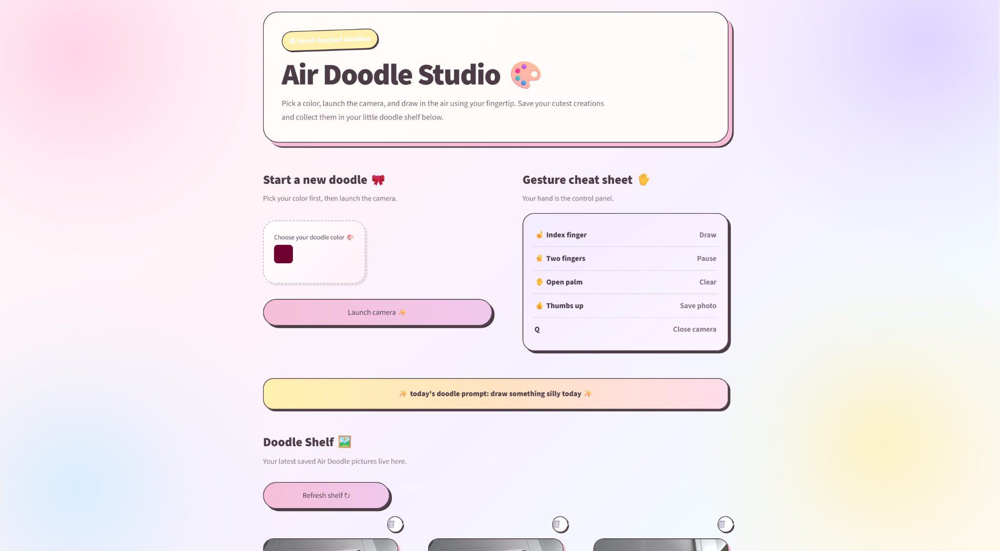
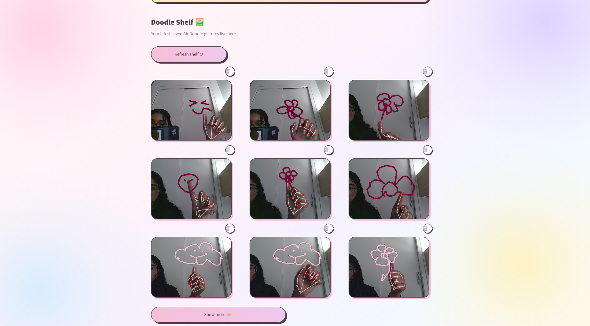
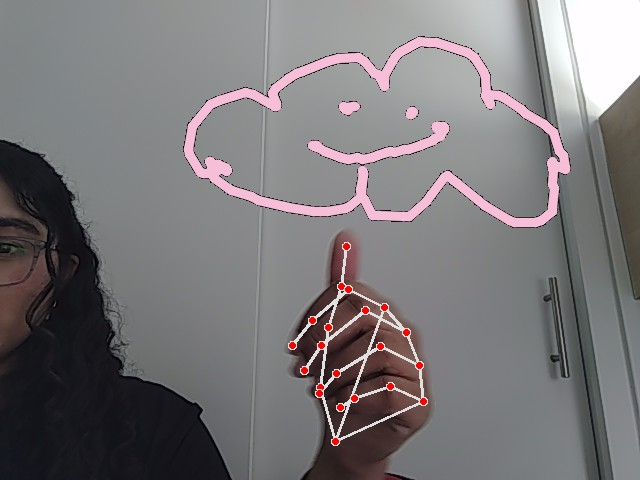
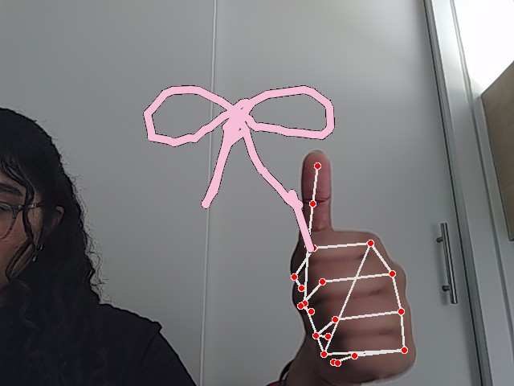

# 🎨 Air Doodle Studio

Air Doodle Studio is a playful computer vision project that lets you draw in the air using hand gestures.

The app uses hand tracking to follow your fingertip, recognize simple gestures, save doodles, and display them in a cute Streamlit gallery.

---

## ✨ App Preview

### Main Interface

Pick a color, launch the camera, and start drawing.



### Doodle Shelf

Saved doodles appear in a gallery where you can review them, delete them, and load more.



### Example Doodles

A few doodles created using the hand-tracking controls:

<p align="center">
  
  
</p>

---

## 🌷 Features

- Choose your own drawing color
- Draw in the air using your index finger
- Pause drawing with two fingers
- Clear the canvas with an open palm
- Save a photo using a thumbs-up gesture
- View saved doodles in a Streamlit gallery
- Delete saved doodles
- Show more / show less gallery controls
- Saved doodle shelf for reviewing creations

---

## ✋ Gesture Controls

| Gesture | Action |
|---|---|
| ☝️ Index finger | Draw |
| ✌️ Two fingers | Pause |
| ✋ Open palm | Clear canvas |
| 👍 Thumbs up | Save photo |
| Q | Close camera |

---

## 🧠 How It Works

Air Doodle Studio uses **MediaPipe** to detect hand landmarks from the webcam feed.

The index fingertip is tracked in real time and converted into screen coordinates. When only the index finger is raised, **OpenCV** draws a line between the current fingertip position and the previous fingertip position.

Different hand gestures are used as controls:

- **Index finger** → Draw
- **Two fingers** → Pause
- **Open palm** → Clear the canvas
- **Thumbs up** → Save the current doodle

The **Streamlit** interface acts as the front end of the project, allowing the user to choose a drawing color, launch the camera, and review saved doodles.

---

## 🛠️ Tech Stack

- Python
- OpenCV
- MediaPipe
- NumPy
- Streamlit

---

## 📁 Project Structure

```text
air-drawing-app/
│
├── images/
│   ├── air_doodle_home.png
│   ├── air_doodle_gallery.png
│   ├── doodle_cloud.png
│   └── doodle_bow.png
│
├── output/
│   └── saved doodle images
│
├── app.py
├── camera_draw.py
├── requirements.txt
├── README.md
└── .gitignore
```

---

## 🚀 How to Run

### 1. Clone the repository

```bash
git clone https://github.com/lamanami/air-drawing-app.git
```

### 2. Move into the project folder

```bash
cd air-drawing-app
```

### 3. Create a virtual environment

```bash
python -m venv .venv
```

### 4. Activate the virtual environment

For Windows PowerShell:

```powershell
Set-ExecutionPolicy -Scope Process -ExecutionPolicy Bypass
.\.venv\Scripts\Activate.ps1
```

### 5. Install the required packages

```bash
pip install -r requirements.txt
```

### 6. Start the Streamlit app

```bash
streamlit run app.py
```

The Streamlit page will open in your browser.

---

## 🎨 How to Use

1. Open the Streamlit app.
2. Choose your doodle color.
3. Click **Launch camera ✨**.
4. Raise your index finger to start drawing.
5. Raise two fingers to pause drawing.
6. Show an open palm to clear the canvas.
7. Give a thumbs-up to save your doodle.
8. Press **Q** to close the camera window.
9. Return to the Streamlit page.
10. Click **Refresh shelf ↻** to view your latest saved doodles.

---

## 🖼️ Doodle Gallery

Saved doodles are stored inside the `output/` folder.

The Streamlit interface displays the saved images in the **Doodle Shelf**, where users can:

- Review saved drawings
- Delete unwanted doodles
- Load more images using the **Show more** button
- Collapse the gallery using **Show less**

---

## 💡 What I Practiced

This project helped me practice:

- Computer vision
- Real-time webcam processing
- Hand landmark detection
- Gesture recognition
- OpenCV drawing operations
- MediaPipe hand tracking
- Streamlit interface design
- Python project organization
- File handling
- Saving and displaying images
- Building an interactive end-to-end application

---

## 🌱 Future Improvements

Possible future improvements include:

- Embedding the live camera directly inside the Streamlit interface
- Adding different brush sizes
- Adding an eraser gesture
- Supporting multiple drawing colors during one session
- Adding downloadable doodle images
- Adding stickers or visual effects
- Improving gesture stability
- Adding more gesture controls

---

## 🎥 Demo

Watch Air Doodle Studio in action:

[▶️ Watch the demo video](https://github.com/user-attachments/assets/a9df800b-47d9-419a-adb7-53ce5f230cec)

---

## 💕 About the Project

Air Doodle Studio was built as a fun computer vision project combining hand tracking, gesture recognition, and a playful pastel interface.

The goal was to create an interactive drawing experience where simple hand gestures could control the application without using a mouse or drawing tablet.
